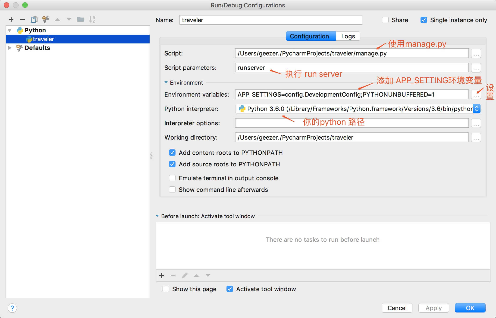

# traveler

[](https://travis-ci.org/travelgeezer/traveler)
[](https://coveralls.io/github/travelgeezer/traveler?branch=master)
[](https://codeclimate.com/github/travelgeezer/traveler)

### Daily tasks
---------------

- word : 30 minutes

- typing practice : 30 minutes

- use shortcuts

- read : a knowledge

- coding : today task


### Todo List
---------------
- [heroku](https://devcenter.heroku.com/)

- hello world

- 使用 git

- 学习该语言的语法

- 实现一个TODO List

- 熟记你所使用的IDE，编辑器的各种快捷建

- 集成 Vue

- 构建一个RESTfull服务

- 尝试设计一个API

- 尝试使用不同过的IDE和编辑器

- 尝试使用命令行工具

- 尝试使用快捷键代替鼠标

- 尝试使用GNU/Linux

- 写一个简单的测试

- 写一个Mock测试

- 写一个Stub测试

- 尝试使用TDD开发一个简单的功能

- 尝试做一些简单的重命名变量

- 尝试一些提取变量的操作

- 尝试做一些重命名现有的函数

- 使用一些针对不同开发环境的插件

- 用Toggle来管理应用的一些新特性

- ~~尝试搭建CI环境~~

- 尝试使用CI创建Build

- 使用虚拟机安装GNU/Linux操作系统

- 理解Tomacat和Jetty的关系

- 使用Docker安装应用程序

- 使用Docker作应用容器

- 尝试回顾自己做的一个项目的Well, Less Well

- 搭建一个静态服务器

- 使用反向代理

- 尝试使用自动部署工具

- 试着添加Google Analytics服务

- 尝试用分析工具分析数据

- 试着用编程来分析数据

- 使用分层架构设计应用

- 了解Pipe and Filters模式


### Read Books
--------------

-《HTML与CSS》(第二版)

-《JavaScript 权威指南》

-《JavaScript 高级程序设计》

-《全栈应用开发：精益实践》


### 技术栈
---------

- python

- flask

- flask-sqlalchemy : ORM Framework

- unittest: 单元测试框架

- mysql: 数据库

- Virtual Environments: 虚拟环境

### setup
----------

1. 安装python3 [install](#user-content-install-python3-)
2. 安装mysql [install](#user-content-install-mysql-)
3. 安装PyCharm IDE([install pycharm](https://www.jetbrains.com/pycharm/))
4. 配置PyCharm [install](#user-content-install-pycharm-)
5. 安装依赖: pip3 install -r requirements.txt
6. 同步数据库: python3 manage.py db init && python3 manage.py db migrate && python3 manage.py db upgrade
7. 运行测试: python3 manage.py test
8. 运行Demo: 运行项目


### Workflow
-------------

1. 获取上游最新代码：``git pull --rebase``
2. 添加修改功能，**小步提交**，即实现某个小功能就本地小步提交一次。如：
    1. 添加某个库，提交一次。
    2. 完成 UI 设计，提交一次。
    3. 完成功能，提交一次。
    4. 编写测试，提交一次。
    5. 修复 Lint，提交一次。
3. 编写、运行测试 ``python3 manage.py test``
4. 提交到服务器
5. 来一个 Pull Request


### 提交信息规范

建议提交信息按如下规范：

```
[任务分类] 主要修改组件：修改内容
```

示例 1，``[T] home: create home app`` 。其中的 ``T`` 表示这是一个技术卡，``home`` 表示修改的是 主页，``create home app`` 则表示创建了主界面用到的app。

示例 2，``[Edit] views: add create article api``。其中的 ``Edit`` 表示修改的是edit app 下的内容，``views`` 则表示修改的是 ``views.py``，``add create article api`` 则表示是添加了创建文章的api接口


### install python3 <span id = "install-python3"></span>
-------------------

- [Installing Python 3 on Mac OS ](http://python-guide-pt-br.readthedocs.io/en/latest/starting/install3/osx/)

- [Installing Python 3 on Linux](http://python-guide-pt-br.readthedocs.io/en/latest/starting/install3/linux/)

- [Installing Python 3 on Windows](http://docs.python-guide.org/en/latest/starting/install3/win/)

- [Virtual Environments](http://docs.python-guide.org/en/latest/dev/virtualenvs/)

- [虚拟环境](http://pythonguidecn.readthedocs.io/zh/latest/dev/virtualenvs.html)

- [mac更改pip源，没有.pip（即linux ubuntu python pip 换源方法教程](http://blog.csdn.net/xx1710/article/details/51893117)

- [windows更改pip源](https://www.v2ex.com/t/291817)


### install mysql <span id = "install-mysql"></span>
-----------------

- [Install MySQL on macOS Sierra](https://gist.github.com/nrollr/3f57fc15ded7dddddcc4e82fe137b58e)

- [How To Install MySQL on Ubuntu 16.04](https://www.digitalocean.com/community/tutorials/how-to-install-mysql-on-ubuntu-16-04)

- [Install MySQL on Windows Using MySQL Installer](http://www.mysqltutorial.org/install-mysql/)


### install PyCharm <span id = "config-pycharm"></span>
  
  1. 查看 [Creating and Editing Run/Debug Configurations](https://www.jetbrains.com/help/pycharm/creating-and-editing-run-debug-configurations.html#createExplicitly)
  2. 配置 
  3. 使用virtualenv [PyCharm创建virtualenv方法](https://my.oschina.net/jhao104/blog/787551)

### 参考资料
-----------

- [The Hitchhiker’s Guide to Python!](http://docs.python-guide.org/en/latest/)

- [flask](http://docs.jinkan.org/docs/flask/)

- [Flask-SQLAlchemy](http://www.pythondoc.com/flask-sqlalchemy/api.html#flask.ext.sqlalchemy.SQLAlchemy)

- [awesome-flask](https://github.com/humiaozuzu/awesome-flask)

- [Implementing a RESTful Web API with Python & Flask](http://blog.luisrei.com/articles/flaskrest.html)

- [Flask by Example - Project Setup](https://realpython.com/blog/python/flask-by-example-part-1-project-setup/)

- [Flask-Migrate](https://flask-migrate.readthedocs.io/en/latest/)

- [discover-flask](https://github.com/realpython/discover-flask)

- [unittest — Unit testing framework](https://docs.python.org/3/library/unittest.html)

- [vue](https://cn.vuejs.org/)

- [phodal](https://www.phodal.com/)

- [w3cplus](https://www.w3cplus.com/)

- [Git教程](http://www.liaoxuefeng.com/wiki/0013739516305929606dd18361248578c67b8067c8c017b000)

- [Git 在团队中的最佳实践--如何正确使用Git Flow](http://www.cnblogs.com/cnblogsfans/p/5075073.html)

- [Syncing a fork](https://help.github.com/articles/syncing-a-fork/)

- [git rebase 的风险](http://git.oschina.net/progit/3-Git-%E5%88%86%E6%94%AF.html#3.6-%E5%88%86%E6%94%AF%E7%9A%84%E8%A1%8D%E5%90%88)

- [Pull Request的正确打开方式（如何在GitHub上贡献开源项目）](http://m.blog.csdn.net/article/details?id=17438153#10006-weixin-1-52626-6b3bffd01fdde4900130bc5a2751b6d1)

- [关于 Pull Request 的十个建议](http://www.oschina.net/news/59961/pull-reques-ten-suggestion#10006-weixin-1-52626-6b3bffd01fdde4900130bc5a2751b6d1)

- [Typing](https://typing.io/)

- [Web前端人员专用单词书](https://www.shanbay.com/wordbook/129934/)

- [JavaScript前端单词书](https://www.shanbay.com/wordbook/169468/)

- [程序员必学电脑计算机专业英语词汇1700词](https://www.shanbay.com/wordbook/104791/)